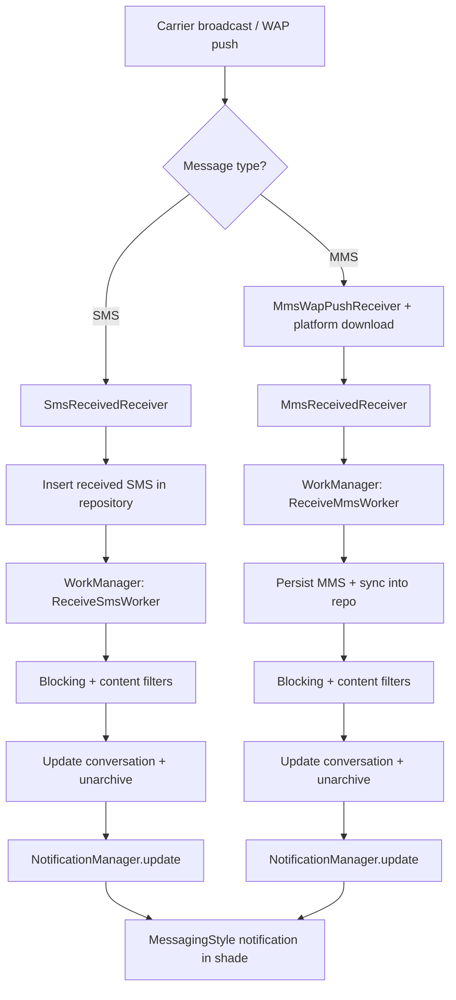

# SMS & MMS receive flow (tower to notification shade)

This document walks through how QUIK receives and processes inbound SMS and MMS messages, starting with the cellular network broadcast and ending with a notification in the shade. It is written for teammates new to the app internals and references the concrete classes involved so you can follow the code.

## High-level overview

1. **Carrier network delivers the message to the device**.
   - **SMS** arrives as a telephony broadcast from Android's SMS stack.
   - **MMS** arrives as a WAP push/download flow; the carrier sends a notification, and the device downloads the MMS payload via the platform MMS stack.
2. **QUIK receives the platform broadcast** via `BroadcastReceiver`s registered in the app manifest.
3. **QUIK hands work off to WorkManager** so processing is reliable and runs off the main thread.
4. **Workers apply blocking, filters, conversation updates, and notifications**.
5. **The NotificationManager builds the messaging-style notification** shown in the shade.

---

## SMS: broadcast to notification

### 1) Android broadcasts the inbound SMS
Android’s telephony stack delivers inbound SMS messages as a broadcast intent that the app receives via `SmsReceivedReceiver`. The receiver is registered in the manifest, so it will be invoked when the device receives a new SMS. 【F:presentation/src/main/AndroidManifest.xml†L141-L176】

### 2) `SmsReceivedReceiver` normalizes and stores the message
`SmsReceivedReceiver` is the entry point for SMS. It:
- Extracts the SMS PDUs from the broadcast intent.
- Concatenates multi-part segments into a single message body.
- Writes the message into the app’s message repository.
- Enqueues `ReceiveSmsWorker` with the newly stored message ID for downstream processing. 【F:data/src/main/java/com/moez/QKSMS/receiver/SmsReceivedReceiver.kt†L35-L74】

### 3) `ReceiveSmsWorker` runs the processing pipeline
The worker performs all the “app-specific” logic:
- **Blocking checks**: consults the blocking client and drop settings; removes the message if it should be dropped. 【F:data/src/main/java/com/moez/QKSMS/worker/ReceiveSmsWorker.kt†L54-L86】
- **Content filtering**: checks message text against content filters and drops if needed. 【F:data/src/main/java/com/moez/QKSMS/worker/ReceiveSmsWorker.kt†L87-L93】
- **Conversation updates**: refreshes the conversation state, unarchives if needed, and skips notifying blocked threads. 【F:data/src/main/java/com/moez/QKSMS/worker/ReceiveSmsWorker.kt†L95-L123】
- **Notification, shortcuts, and badge updates**: updates the conversation notification, shortcut state, and badge/widget counts. 【F:data/src/main/java/com/moez/QKSMS/worker/ReceiveSmsWorker.kt†L125-L138】

### 4) `NotificationManagerImpl` builds the shade notification
When the worker calls `notificationManager.update(threadId)`, the notification system:
- Loads unread/unseen messages for the conversation.
- Builds a `MessagingStyle` notification with participant info and message previews.
- Uses conversation/channel preferences for sound, vibration, and preview settings.
- Posts the notification (or cancels if there’s nothing to show). 【F:presentation/src/main/java/com/moez/QKSMS/common/util/NotificationManagerImpl.kt†L105-L220】

---

## MMS: WAP push to notification

### 1) Android receives the MMS notification & downloads the payload
MMS follows a two-step flow:
1. The carrier sends a **notification indication** (WAP push) to the device.
2. The device downloads the MMS payload using the platform MMS stack.

QUIK integrates with the platform flow via `MmsWapPushReceiver` (WAP push entry point) and `MmsReceivedReceiver` (invoked once the payload is downloaded). These receivers are registered in the manifest. 【F:presentation/src/main/AndroidManifest.xml†L149-L176】

### 2) `MmsReceivedReceiver` enqueues `ReceiveMmsWorker`
Once the payload download completes, `MmsReceivedReceiver`:
- Reads the download file path and metadata (content location, subscription ID, etc.).
- Enqueues `ReceiveMmsWorker` with those inputs so work runs off the main thread. 【F:data/src/main/java/com/moez/QKSMS/receiver/MmsReceivedReceiver.kt†L60-L95】

### 3) `ReceiveMmsWorker` persists, syncs, and processes the MMS
`ReceiveMmsWorker` performs the heavy lifting:
- **Reads the downloaded payload** from the temporary file. 【F:data/src/main/java/com/moez/QKSMS/worker/ReceiveMmsWorker.kt†L87-L112】
- **Persists the message** into the system MMS provider and syncs it into QUIK’s repository. 【F:data/src/main/java/com/moez/QKSMS/worker/ReceiveMmsWorker.kt†L118-L146】
- **Marks active conversations as read** if the user is already viewing the thread. 【F:data/src/main/java/com/moez/QKSMS/worker/ReceiveMmsWorker.kt†L148-L156】
- **Blocking and content filters**: drops the message if required, or marks threads blocked/unblocked. 【F:data/src/main/java/com/moez/QKSMS/worker/ReceiveMmsWorker.kt†L162-L214】
- **Conversation refresh + notification updates**: updates conversation metadata, unarchives as needed, and calls `notificationManager.update`. 【F:data/src/main/java/com/moez/QKSMS/worker/ReceiveMmsWorker.kt†L216-L250】
- **Acknowledges the MMS to the MMSC** by sending `m-acknowledge.ind` and `m-notifyresp.ind` responses. 【F:data/src/main/java/com/moez/QKSMS/worker/ReceiveMmsWorker.kt†L252-L347】

### 4) Notification display mirrors SMS
After processing, the MMS flow uses the same `NotificationManagerImpl` update path, so the same unread/unseen logic and `MessagingStyle` notification rendering is applied. 【F:presentation/src/main/java/com/moez/QKSMS/common/util/NotificationManagerImpl.kt†L105-L220】

---

## Mermaid flow chart (summary)

